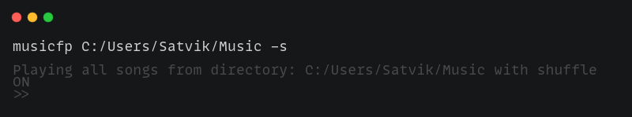
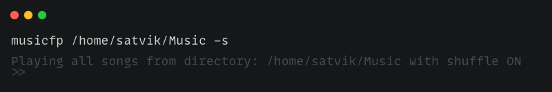
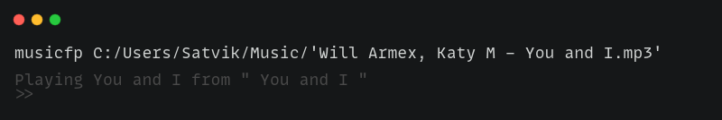
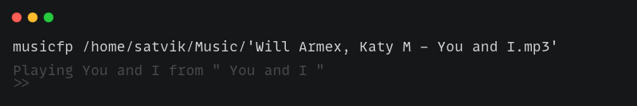
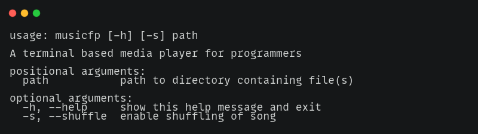
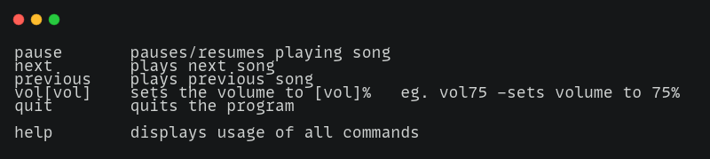

# musicfp
**A terminal based media player for programmers**

------------

## Install

------------

## Examples

### Playing all songs in a direstory

> #### Windows

> 

> #### macOS / Linux

> 

### Playing a single song in a directory

> #### Windows

> 

> #### macOS / Linux

> 

------------

## Usage

> 

### Playback controls

> 

------------

## Contributing

Contributions, issues and feature requests are welcome!
Feel free to check [Bug Tracker](https://github.com/SatvikVirmani/musicfp/issues "issues") page.
To submit improvements or features check [Pull Requests](https://github.com/SatvikVirmani/musicfp/pulls "Pull Requests")
